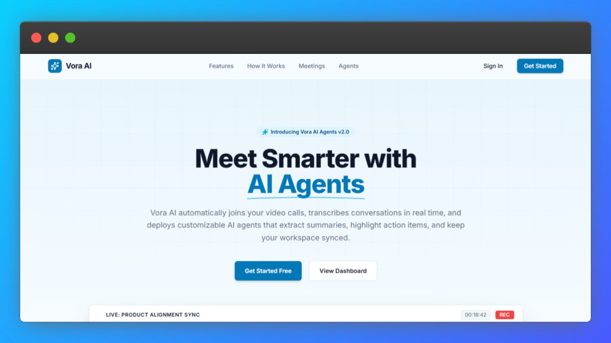

# Vora AI



## Overview

Vora AI is a full-stack AI meeting assistant platform that helps users create custom AI agents, schedule meetings, join video calls, and review meeting outputs such as summaries, transcripts, and recordings.

The project includes:

- authentication with protected dashboard routes
- AI agent creation with custom meeting instructions
- meeting creation, filtering, editing, and status tracking
- Stream-powered video calls with lobby, active call, and ended states
- webhook-driven meeting lifecycle updates
- Inngest background processing for transcript parsing and summaries
- completed meeting view with summary, transcript, and recording tabs
- responsive SaaS landing page and dashboard UI

## Features

- **Authentication:** Users can sign in, register, and access protected dashboard pages.
- **AI Agents:** Create reusable agents with names, avatars, and custom instructions.
- **Meetings Dashboard:** Create, search, filter, edit, and remove meetings.
- **Meeting Filters:** Filter meetings by status and assigned agent.
- **Video Calls:** Join meetings through a Stream Video call experience.
- **Meeting Status Flow:** Meetings move through upcoming, active, processing, completed, and cancelled states.
- **Completed Meeting View:** Review formatted summaries, transcript state, and recording playback.
- **Background Processing:** Inngest handles transcript parsing, speaker matching, and summary saving.
- **Webhook Integration:** Stream webhooks update meeting status, recording URLs, and transcript URLs.
- **Responsive UI:** Landing page, dashboard, auth pages, and call screens are mobile-friendly.

## Tech Stack

- **Next.js 16**: App Router, server components, and API routes
- **React 19**: UI rendering
- **TypeScript**: Type-safe application code
- **Tailwind CSS**: Utility-first styling
- **Shadcn UI / Radix UI**: Reusable UI primitives
- **tRPC**: End-to-end typed API layer
- **TanStack Query**: Client data fetching and cache management
- **Drizzle ORM**: Database schema and queries
- **Neon PostgreSQL**: Serverless Postgres database
- **Better Auth**: Authentication and session management
- **Stream Video**: Video calling, recordings, transcriptions, and webhooks
- **Inngest**: Background jobs and async meeting processing
- **Inngest Agent Kit**: AI summary workflow integration
- **DiceBear**: Generated avatars for users and agents
- **Lucide React**: Icon system

## Core Modules

- **Auth:** Login, registration, sessions, and protected layouts
- **Agents:** Agent creation, editing, deletion, search, and detail pages
- **Meetings:** Meeting CRUD, filters, data table, detail pages, and status-specific UI
- **Call:** Video call lobby, active call UI, call controls, and ended state
- **Webhooks:** Stream event handling for call start, end, recording, and transcription events
- **Inngest:** Transcript parsing, speaker matching, fallback summaries, and meeting completion
- **Landing:** Public marketing page with hero, workflow, features, collaboration, CTA, and footer

## Getting Started

### Prerequisites

- **Node.js** 20 or higher
- **npm**
- **Neon PostgreSQL** database URL
- **Better Auth** secret
- **Google OAuth** credentials
- **Stream Video** API key and secret
- **Inngest** dev server for local background jobs
- Optional AI provider key for live AI summaries

## Installation

1. **Clone the repository**

   ```bash
   git clone <your-repository-url>
   cd voraai
   ```

2. **Install dependencies**

   ```bash
   npm install
   ```

3. **Create environment variables**

   Create a `.env` file in the project root:

   ```env
   DATABASE_URL=your_neon_database_url

   BETTER_AUTH_SECRET=your_auth_secret
   BETTER_AUTH_URL=http://localhost:3000

   GOOGLE_CLIENT_ID=your_google_client_id
   GOOGLE_CLIENT_SECRET=your_google_client_secret

   NEXT_PUBLIC_STREAM_VIDEO_API_KEY=your_stream_video_api_key
   STREAM_VIDEO_SECRET_KEY=your_stream_video_secret_key

   NEXT_PUBLIC_APP_URL=http://localhost:3000

   OPENAI_API_KEY=optional_openai_key
   NEXT_PUBLIC_OPENAI_API_KEY=optional_openai_key
   NEXT_PUBLIC_GEMINI_API_KEY=optional_gemini_key
   ```

4. **Push database schema**

   ```bash
   npm run db:push
   ```

5. **Start the Next.js app**

   ```bash
   npm run dev
   ```

6. **Start Inngest locally**

   In another terminal:

   ```bash
   npx inngest-cli@latest dev -u http://localhost:3000/api/inngest
   ```

7. **Open the app**

   Visit [http://localhost:3000](http://localhost:3000)

## Usage

### Running the App

- **Development:** `npm run dev`
- **Production build:** `npm run build`
- **Production start:** `npm run start`
- **Lint:** `npm run lint`
- **Push DB schema:** `npm run db:push`
- **Open DB studio:** `npm run db:studio`

### Main Routes

- `/` - public landing page or dashboard redirect for signed-in users
- `/login` - login page
- `/register` - registration page
- `/meetings` - meetings dashboard
- `/meetings/[meetingId]` - meeting detail page
- `/agents` - agents dashboard
- `/agents/[agentId]` - agent detail page
- `/call/[meetingId]` - video call page
- `/api/webhook` - Stream webhook endpoint
- `/api/inngest` - Inngest function endpoint
- `/api/trpc/*` - tRPC API endpoint

### Meeting Flow

1. Create an AI agent with meeting instructions.
2. Create a meeting and assign the agent.
3. Start the meeting from the meeting detail page.
4. Join the Stream Video call.
5. Stream webhooks update the meeting status and media URLs.
6. Inngest processes transcripts and saves a summary.
7. Review the completed meeting summary, transcript state, and recording.

### Agent Flow

1. Create an agent with a name and instructions.
2. Use the agent when creating meetings.
3. Search, edit, or remove agents from the dashboard.
4. Agent avatars are generated automatically from the agent name.

## Deployment Notes

- Configure all production environment variables in your hosting provider.
- Set `BETTER_AUTH_URL` and `NEXT_PUBLIC_APP_URL` to your production domain.
- Configure Stream webhooks to point to:

  ```text
  https://your-domain.com/api/webhook
  ```

- Configure Inngest to sync with:

  ```text
  https://your-domain.com/api/inngest
  ```

- AI providers may require active billing or credits. The app includes fallback handling so meetings can still complete when AI credits are exhausted.

## Project Structure

```text
voraai/
  app/                 # Next.js routes, API routes, layouts
  components/          # Shared UI components
  db/                  # Drizzle schema and database client
  hooks/               # Shared React hooks
  inngest/             # Inngest client and background functions
  lib/                 # Auth, Stream, avatar, and utility helpers
  modules/views/       # Feature modules for auth, landing, dashboard, agents, meetings, call
  trpc/                # tRPC client/server setup and routers
```

## License

This project is private and intended for portfolio/demo use.
